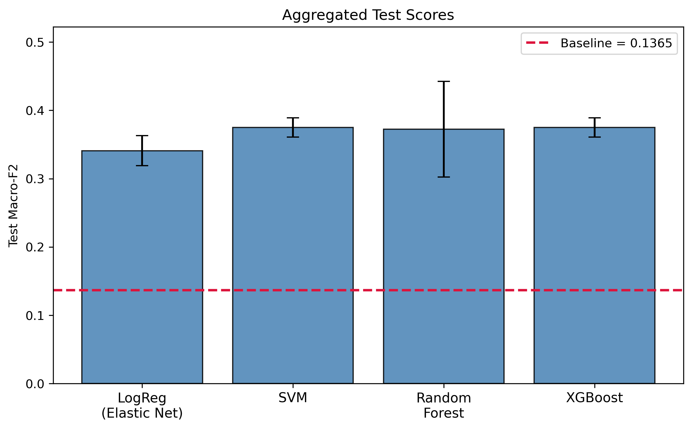
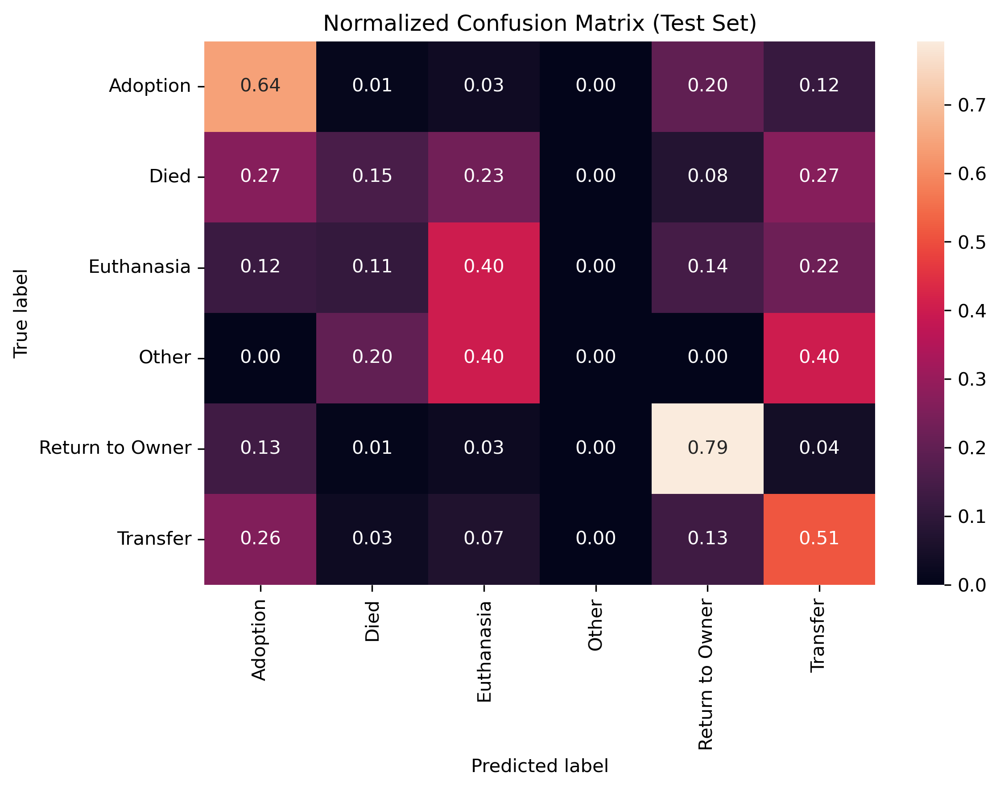
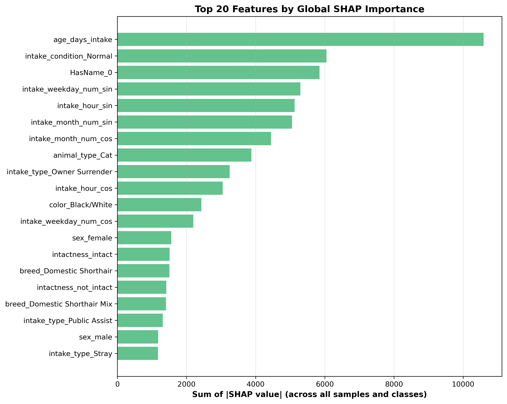

# Animal Shelter Outcome Prediction

Predicting the **outcome** of a cat or dog entering the **Austin Animal Center (AAC)** — using **only the information available at intake time**.

Given who an animal is and how it arrived (species, age, sex, intake type/condition, breed, color, time of arrival, …), the model predicts what will happen to it: **Adoption, Transfer, Return to Owner, Euthanasia, Died, or Other**. Because these predictions rely purely on intake-time features, they could help shelter staff triage animals, plan capacity, and flag at-risk cases early.

> This was the final project for **DATA 1030 – Hands-on Data Science** at Brown University.
> The full write-up, methodology, and discussion live in [`report/data1030_report.pdf`](report/data1030_report.pdf)
> and the slide deck in [`Presentation/data1030_final_presentation.pdf`](Presentation/data1030_final_presentation.pdf).

---

## Problem framing

- **Task:** multiclass classification of `outcome_type` (6 classes).
- **Species:** cats and dogs only.
- **Constraint (no data leakage):** only features known *at intake* are used. Outcome-time fields (e.g. age/sex recorded at outcome, outcome datetime) are dropped so the model reflects a realistic "predict-at-arrival" scenario.
- **Class imbalance:** outcomes are highly imbalanced (Adoption and Transfer dominate; Died is rare). Models are evaluated with the **macro-averaged F2 score**, which weights recall higher than precision and treats every class equally — important when the rare outcomes are the ones we most want to catch.

---

## Dataset

Source: [Austin Animal Center Intakes & Outcomes](https://data.austintexas.gov/) (open data).

After cleaning, merging intakes with outcomes, and engineering features, the modelling table has **135,206 rows** and **14 features**. A full column-by-column description is in [`data/Dataset Description.txt`](data/Dataset%20Description.txt). In brief:

| Feature | Type | Notes |
|---|---|---|
| `visit_count` | numeric | how many times the animal has entered the shelter |
| `intake_type` | categorical | Stray, Owner Surrender, Public Assist, … |
| `intake_condition` | categorical | Normal, Injured, Sick, Neonatal, … (20 values) |
| `animal_type` | categorical | Cat or Dog |
| `HasName` | binary | did the animal have a name at intake |
| `intake_month_num`, `intake_weekday_num`, `intake_hour` | cyclical | encoded as sine/cosine pairs |
| `breed`, `color` | high-cardinality categorical | 2,716 breeds / 616 colors |
| `intactness` | categorical | intact / not_intact / unknown (spay-neuter status) |
| `sex` | categorical | female / male / unknown |
| `age_days_intake` | numeric | age in days at intake |
| **`outcome_type`** | categorical | **target** — 6 classes |

### Getting the data

The raw and processed CSVs are large and are **not stored in this repo**. Download them and place them in `data/`:

- **Data (CSVs):** https://drive.google.com/drive/folders/1wF2DhvBdwzhu8MxORFRXhM7_FQDj2ZdW?usp=sharing

Expected files in `data/` after download:

```
data/
├── aac_intakes.csv              # raw intakes
├── aac_outcomes.csv             # raw outcomes
├── merged_outcomes_intakes.csv  # intakes joined to outcomes
├── data_for_modelling.csv       # cleaned, feature-engineered modelling table
└── Dataset Description.txt       # column dictionary (in repo)
```

---

## Approach

1. **Data extraction & cleaning** — merge intakes and outcomes on animal, keep cats/dogs, drop leakage-prone columns, derive `intactness`/`sex`, and build `visit_count` and `HasName`.
2. **Feature engineering** — split intake datetime into month/weekday/hour and encode them **cyclically** (sin/cos); one-hot encode categoricals; standard-scale numerics.
3. **Modelling** — four model families, each tuned over a hyperparameter grid across **5 random seeds** with a **60/20/20 train/validation/test split**. Class imbalance is handled with class weights. The primary metric is **macro F2**.
4. **Interpretation** — permutation importance, XGBoost's built-in importances, and **SHAP** (global + local explanations) to understand *why* the model predicts what it does.

> ⚙️ For tractable tuning, the modelling notebooks fit on a **10% stratified sample** (~13.5k rows → 8,112 train / 2,704 val / 2,705 test). See the config cell in each `Finals_*` notebook.

---

## Results

Models are compared against a baseline that always predicts the majority-ish class (**test macro F2 = 0.137**). All numbers are **mean ± std across 5 seeds**.

| Model | Validation F2 | Test F2 |
|---|---|---|
| **XGBoost** ⭐ | **0.387 ± 0.006** | **0.375 ± 0.015** |
| SVM (RBF) | 0.381 ± 0.018 | 0.375 ± 0.014 |
| Random Forest | 0.376 ± 0.006 | 0.372 ± 0.007 |
| Logistic Regression (ElasticNet) | 0.343 ± 0.010 | 0.341 ± 0.022 |
| Baseline | — | 0.137 |

All models roughly **triple** the baseline F2. **XGBoost** was selected as the final model (best validation score, competitive test score, and fast, interpretable). Its tuned configuration favors shallow trees (`max_depth = 3`, light L1/L2 regularization) with early stopping.

<p align="center">
  
  
</p>

### What drives the predictions (SHAP)

Global SHAP importances show that **intake condition, intake type, age, spay/neuter status, and whether the animal has a name** are the strongest drivers of outcome.

<p align="center">
  
</p>

More plots — hyperparameter heatmaps, per-feature outcome breakdowns, per-class local SHAP explanations, and interactive SHAP force plots (HTML) — are in [`figures/`](figures/).

---

## Repository layout

```
.
├── data/          # dataset dictionary (CSVs downloaded separately — see above)
├── src/           # all notebooks: extraction → EDA → modelling → interpretation
├── figures/       # every generated plot (EDA, tuning, confusion matrices, SHAP)
├── results/       # saved model artifacts (.pkl — downloaded separately, see below)
├── report/        # final PDF report
├── Presentation/  # final presentation slides (PDF)
├── data1030.yml   # Conda environment specification
├── requirements.txt  # pip alternative to the Conda env
└── LICENSE        # MIT
```

### Notebooks (`src/`), in the order they should be run

| Notebook | Purpose |
|---|---|
| `Data_Extraction.ipynb` | Load raw CSVs, merge intakes + outcomes, clean, produce `merged_outcomes_intakes.csv` |
| `Exploration.ipynb` | EDA, feature engineering, and the plots in `figures/`; writes `data_for_modelling.csv` |
| `Finals_LogisticRegression.ipynb` | ElasticNet logistic regression pipeline + tuning |
| `Finals_RF.ipynb` | Random Forest pipeline + tuning |
| `Finals_SVM.ipynb` | SVM (RBF) pipeline + tuning |
| `Finals_XGB.ipynb` | XGBoost pipeline + tuning (final model) |
| `Global_Feature_Importance_XGB.ipynb` | Permutation importance, XGBoost importances, global SHAP |
| `SHAP_XGB - Local+Global.ipynb` | Global + per-class local SHAP explanations |

Each modelling notebook saves its tuning artifacts to `results/pipeline_results_<model>.pkl`.

---

## How to run

### 1. Set up the environment

**Option A — Conda (recommended, reproduces the exact versions):**

```bash
conda env create -f data1030.yml
conda activate data1030
python -c "import numpy, pandas, sklearn, xgboost, shap; print('OK')"
```

**Option B — pip / venv:**

```bash
python -m venv .venv
# Windows:  .venv\Scripts\activate
# macOS/Linux:  source .venv/bin/activate
pip install -r requirements.txt
```

Key packages: Python 3.12, numpy 2.2, pandas 2.2, scikit-learn 1.6, xgboost 3.0, shap 0.47, matplotlib 3.10, seaborn 0.13.

### 2. Get the data

Download the CSVs from the [data Drive folder](https://drive.google.com/drive/folders/1wF2DhvBdwzhu8MxORFRXhM7_FQDj2ZdW?usp=sharing) into `data/` (see [Getting the data](#getting-the-data)).

### 3a. Reproduce everything from scratch

```bash
jupyter lab   # or: jupyter notebook
```

Run the notebooks in `src/` in the order listed above. `Data_Extraction` → `Exploration` regenerate the processed data and figures; the `Finals_*` notebooks train and tune the models.

### 3b. Just load the trained models

Training/tuning is compute-heavy, so the saved artifacts are hosted separately. Download them into `results/`:

- **Results (.pkl artifacts):** https://drive.google.com/drive/folders/1rUGrAiCm9zcT76vAWFSQJfdOqtGtUpvF?usp=sharing

Then load, e.g. the final XGBoost model:

```python
import pickle
with open("results/final_model_XGB_results.pkl", "rb") as f:
    results = pickle.load(f)
```

---

## Environment details

- **Env name:** `data1030`
- **Python:** 3.12.10
- Full pinned spec in [`data1030.yml`](data1030.yml) (Conda) and [`requirements.txt`](requirements.txt) (pip).

## License

Released under the [MIT License](LICENSE). © 2025 Vinayak Mokashi.

Data © Austin Animal Center / City of Austin, distributed under the City of Austin open-data terms.
